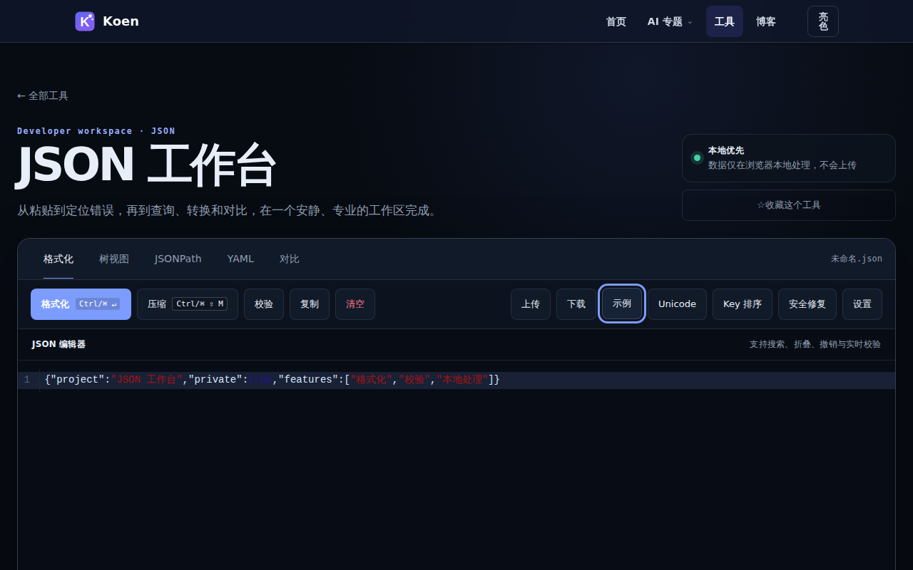

# Koen's 工具箱 · 开发者工具导航站

> 目录收录 73 条开发与建站资源，其中 10 款为浏览器内自研工具；`online-tools` 数据分类包含 11 条记录。纯静态实现，可直接部署到 **GitHub Pages**（默认）或 **1Panel**。分类与数量以 `data/tools.js` 为准。

<!-- catalog-total: 73 -->
<!-- catalog-self-built: 10 -->
<!-- catalog-online-tools: 11 -->

## 产品路线

本项目唯一活跃的路线来源是 [产品路线图](docs/roadmap.md)。当前技术栈继续使用 Vanilla HTML、CSS 和 JavaScript；阶段状态、准入条件、验收证据与商业化约束均在该路线图维护。

## 预览

| 首页导航 | JSON 工具（实时校验 + 行号） | 技术博客 |
|----------|------------------------------|----------|
|  |  |  |

> 截图由 `npm run capture-screenshots` 生成，见 [更新截图](#更新预览截图)。

## 功能特性

- **分类筛选**：AI 工具 / 开发工具 / 建站工具 / 安全工具 / 运维监控 / 设计资源 / 在线工具
- **实时搜索**：按名称、描述、标签即时过滤
- **暗色模式**：跟随系统偏好 + 手动切换，偏好持久化
- **工具详情页**：每个工具独立详情页，含同类推荐
- **在线工具集**：10 款浏览器内工具（JSON / 时间戳 / Cron / Base64 / JWT / SQL / 正则 / UUID / Diff / 颜色），纯前端、数据不出站
- **响应式设计**：移动端、平板、桌面全适配
- **精选标记**：高频推荐工具标注精选徽章
- **🎮 彩蛋系统**：隐藏的"激活工具"分类，5 种趣味解锁方式！

## 在线工具（`/tools/`）

| 工具 | 路径 | 亮点 |
|------|------|------|
| **JSON 格式化** | `/tools/json/` | 实时校验、行号定位、树形视图、宽松解析（注释/尾逗号）、修复/压缩、JSON Path 查询 |
| 时间戳转换 | `/tools/timestamp/` | 秒/毫秒、多时区 |
| Cron 生成器 | `/tools/cron/` | 表达式解析与下次执行时间 |
| Base64 | `/tools/base64/` | 编解码 + SHA 摘要 |
| JWT 解码 | `/tools/jwt/` | Header/Payload 解析 + HMAC 验签 |
| SQL 格式化 | `/tools/sql-formatter/` | 关键字大写、缩进、压缩 |
| 正则测试 | `/tools/regex/` | 匹配高亮 + JS/Java 代码生成 |
| UUID 生成器 | `/tools/uuid/` | 批量生成 UUID |
| 文本 Diff | `/tools/diff/` | 文本差异对比 |
| 颜色工具 | `/tools/color/` | 颜色格式转换与预览 |

公开规范 URL 统一使用 `/tools/<slug>/`。`pages/tools/*.html` 是实现、嵌入或兼容页面，不是公开规范 URL。各工具页由 `js/tool-chrome.js` 统一导航与复制反馈；能力分布在各 `js/*-tool.js` 中（Path 查询、验签、SQL 分析、Diff 等）。

## 工具分类

与 `data/tools.js` 中 `CATEGORIES` 一致（不含「全部」；「激活工具」为彩蛋隐藏 Tab，见下文）：

| 分类 | 数量 | 代表工具 |
|------|------|----------|
| 🤖 AI 工具 | 21 | Dify、Codeium 等（外链索引；选型见 [AI 专题](pages/ai/index.html)） |
| 🛠️ 开发工具 | 11 | VS Code、GitHub、Postman、CodeSandbox |
| 🌐 建站工具 | 8 | Vercel、Netlify、Cloudflare、Porkbun |
| 🔒 安全工具 | 6 | SSL Labs、VirusTotal、Bitwarden |
| 📊 运维监控 | 7 | UptimeRobot、Grafana、Sentry |
| 🎨 设计资源 | 7 | Figma、Iconify、Coolors、Google Fonts |
| 🧰 在线工具 | 11 | **JSON 格式化**、JWT 解码、时间戳、Cron、SQL、正则（含 10 款自研工具） |
| 🔑 激活工具（隐藏） | 2 | KMS、JRebel |

> 目录合计 **73** 条。商业口径报告可排除 2 条隐藏激活记录，但它们不会从目录总数中静默移除；彩蛋解锁后会出现隐藏的「🔑 激活工具」分类 Tab（`CATEGORIES` 中 `hidden: true`）。

## 文件结构

```
dev-tools-nav/
├── index.html              # 主页（导航 + 工具卡片列表）
├── favicon.ico / favicon.svg
├── css/
│   ├── style.css           # 全站样式（CSS 变量、暗色模式、响应式）
│   ├── tools.css           # 在线工具页共享样式
│   └── ai-topic.css        # AI 专题页样式
├── js/
│   ├── main.js             # 搜索过滤、分类、彩蛋、侧栏等
│   ├── base.js             # 全站导航注入、主题、Umami 统计
│   ├── json-tool.js        # JSON 工具核心逻辑（实时校验、树形视图、宽松解析）
│   ├── tool-chrome.js      # 在线工具共享壳层（导航、Toast、本地处理提示）
│   ├── *-tool.js           # 各工具独立逻辑（json、timestamp、cron 等）
│   ├── tools-hub.js        # 工具汇总页交互
│   └── ai-related-reads.js # AI 子页底部「延伸阅读」注入
├── pages/
│   ├── template.html       # 工具详情页（?id=xxx）
│   ├── ai/                 # AI 专题子页
│   ├── blog/               # 技术博客
│   └── tools/              # 在线工具（json、timestamp、cron 等）
├── data/
│   ├── tools.js            # 工具数据 TOOLS_DATA
│   ├── ai-compare.js       # AI 专题数据（横评、工作流、Prompt、入门、价格、AI_TOOL_INFO）
│   ├── articles.js         # 首页「最新动态」文章区
│   └── servers.json        # JRebel 等（可由 Actions 同步更新）
├── assets/                 # Logo、预览截图（screenshot*.png）
├── scripts/
│   ├── capture-screenshots.mjs  # Playwright 截取 README 用预览图
│   ├── sync-csdn-rss.py         # 同步 CSDN RSS
│   └── sync-open-source-radar.py # 同步 AI 开源项目雷达
├── docs/                   # 部署说明等（不随 Pages 发布，见 docs/README.md）
├── deploy.sh               # 同步到 1Panel 的本地脚本
├── package.json            # npm test、capture-screenshots（Playwright）
└── .github/workflows/
    ├── deploy-pages.yml    # GitHub Pages 自动发布
    ├── deploy-1panel-ssh.yml  # 可选：SSH 同步到 1Panel
    ├── update-screenshots.yml # 每周计划运行；成功状态以 GitHub Actions 为准
    ├── sync-csdn-rss.yml      # 定时同步 CSDN RSS
    ├── sync-open-source-radar.yml # 每周同步 AI 开源项目雷达
    └── sync-jrebel.yml     # 定时同步 JRebel 配置
```

## AI 专题（当前能力）

AI 专题当前是静态精选手册，已上线能力如下。后续优先级与状态只在 [产品路线图](docs/roadmap.md) 维护，本节不保存第二份路线或待办。

| 模块 | 说明 |
|------|------|
| **专题首页** `pages/ai/index.html` | Hero + 术语/安全链；**推荐学习路径** 5 步；**术语折叠预览**；**近期更新**（`AI_TOPIC_CHANGELOG`）；**按角色快选**（`AI_ROLE_QUICK_PICK`）；**场景速查内链**；探索专题卡（含 dev-api；工具名徽章 favicon）；价格 `id="pricing-ai"` + **快照日期**（`AI_PRICING_SNAPSHOT_DATE`）；选型短文；**专题内导航条**；底部 **延伸阅读**（`js/ai-related-reads.js`） |
| **开发者向** `pages/ai/dev-api.html` | 网页 vs API vs IDE 助手、何时用 API、链主站 `template.html` 与编程横评 |
| **AI 开源项目雷达** `pages/ai/open-source-radar.html` | 每周筛选 GitHub Trending 中 AI/ML/Agent 热门项目，按本周新增 Star 排序，提供中文概述、核心功能和适用场景标签；数据由 `scripts/sync-open-source-radar.py` + [`.github/workflows/sync-open-source-radar.yml`](.github/workflows/sync-open-source-radar.yml) 每周一自动同步，中文解读可人工润色 |
| **术语与选型** `pages/ai/glossary.html` | 三条选型原则（`AI_SELECTION_PRINCIPLES`）+ 可展开术语表（`AI_GLOSSARY_DATA`）+ **页内术语目录（TOC）** |
| **隐私与安全** `pages/ai/safety.html` | 清单式章节（`AI_SAFETY_DATA`） |
| **横评对比** `pages/ai/compare.html` | 6 组横评（对话 / 编程 / 绘图 / 搜索 / 视频 / 翻译），维度评分与结论；**页顶声明**（`AI_COMPARE_PAGE_DISCLAIMER`）；每组 **方法/局限**（`AI_COMPARE_META`） |
| **场景工作流** `pages/ai/workflow.html` | 多场景步骤 + 工具标签 + Prompt 片段 |
| **Prompt 模板库** `pages/ai/prompts.html` | 按分类筛选、复制模板；分类 section 设 `id="prompt-*"`，URL hash 可定位并自动筛分类 |
| **新手入门** `pages/ai/beginner.html` | 基础概念、上手步骤、误区、学习路径 |
| **数据与映射** `data/ai-compare.js` | 上列外加 `AI_TOPIC_CHANGELOG`、`AI_LEARN_PATH_STEPS`、`AI_GLOSSARY_DATA`、`AI_SELECTION_PRINCIPLES`、`AI_SAFETY_DATA`；以及 `AI_COMPARE_DATA`、`AI_COMPARE_META`、`AI_COMPARE_PAGE_DISCLAIMER`、`AI_WORKFLOW_DATA`、`AI_LOOKUP_SCENES`（场景速查 + `toolIds`）、`AI_RELATED_READS_LINKS`、`AI_TRUST_STATEMENT`、`AI_PRICING_SNAPSHOT_DATE`、`AI_ROLE_QUICK_PICK` 等；术语条目支持可选 `termEn` / `seeAlso` |
| **Changelog 自动化** `scripts/generate-ai-changelog.mjs` | CI 部署前从 git log 提取 AI 专题 commit，按日期分组，智能生成 title/detail，自动写入 `data/ai-compare.js` |
| **专题样式** `css/ai-topic.css` | 含 `ai-subnav`、changelog、场景速查内链、横评/工作流等各页布局；favicon 与徽章样式 |
| **全站入口** | `index.html` 导航「AI 专题」、AI 分类下横幅等（与 `js/main.js` 联动） |
| **SEO** | `scripts/generate-sitemap.mjs` 生成 `sitemap.xml` 时扫描 `pages/ai/*.html` 并写入 URL（CI 部署前执行） |

---

## 本地运行

直接用浏览器打开 `index.html`，或使用任意静态服务器：

```bash
# 使用 Python
python3 -m http.server 8080

# 使用 Node.js (npx)
npx serve .

# 使用 VS Code Live Server 插件
# 右键 index.html → Open with Live Server
```

### 更新预览截图

修改首页或在线工具 UI 后，在仓库根目录执行：

```bash
# 终端 1：起静态服务（端口勿与占用冲突）
python3 -m http.server 9876

# 终端 2：截取 assets/screenshot*.png
BASE_URL=http://127.0.0.1:9876 npm run capture-screenshots
```

输出文件：

| 文件 | 页面 |
|------|------|
| `assets/screenshot.png` | 首页 |
| `assets/screenshot-json-tool.png` | JSON 工具（自动点「示例」） |
| `assets/screenshot-blog.png` | 博客列表 |

CI 工作流 [`.github/workflows/update-screenshots.yml`](.github/workflows/update-screenshots.yml) 每周计划运行；成功状态以 GitHub Actions 为准。

## 部署到 GitHub Pages

仓库已配置 [`.github/workflows/deploy-pages.yml`](.github/workflows/deploy-pages.yml)：推送 `main` 后自动打包静态资源并发布。Pages、本地 `deploy.sh` 与 1Panel SSH 三套部署 manifest 分别维护，排除范围并非逐字节一致；差异与核对方式见 [1Panel 部署说明](docs/deploy-1panel.md)。

| 步骤 | 说明 |
|------|------|
| 日常发布 | `git push origin main` → 打开 **Actions** → **Deploy GitHub Pages** 成功即可 |
| 首次 Fork / 新仓库 | 在 **Settings → Pages → Source** 选择 **GitHub Actions**；工作流里已设 `enablement: true`，多数情况下会自动启用 Pages |
| 线上地址 | **<https://songyuankun.github.io/dev-tools-nav/>** |

**费用**：本仓库为 **Public** 时，标准 GitHub Actions 用量对公开仓库通常 **不单独计费**；私有仓库有每月分钟数额度，详见 [GitHub Actions 计费](https://docs.github.com/zh/billing/concepts/product-billing/github-actions)。

> 可选：若不用 Actions，可在 Pages 中选 **Deploy from a branch** → `main` → `/ (root)`，与本工作流二选一即可。

## 部署到 1Panel

自建服务器可使用 1Panel 托管，与 GitHub Pages 无冲突。详细目录、`rsync` 与 `./deploy.sh` 说明见 **[docs/deploy-1panel.md](docs/deploy-1panel.md)**。

简要步骤：在 1Panel 创建静态网站 → 配置 Git 或手动同步仓库根目录下的 `index.html`、`css/`、`js/`、`data/`、`pages/`、`assets/` 等 → 绑定域名与 SSL。

## 添加新工具

编辑 `data/tools.js`，在 `TOOLS_DATA` 数组中添加新对象：

```js
{
  id: "unique-id",           // 唯一标识符（英文、数字、连字符）
  name: "工具名称",
  description: "工具描述，建议 50-100 字。",
  category: "dev",           // dev | hosting | security | ops | design | online-tools | activate
  tags: ["标签1", "标签2"],
  url: "https://example.com/",
  icon: "https://example.com/favicon.ico",  // 可选，加载失败会显示分类 emoji
  featured: false,           // true 表示精选，优先展示
}
```

## 添加新分类

编辑 `data/tools.js` 中的 `CATEGORIES` 数组：

```js
{ id: "new-category", label: "新分类名称", icon: "🆕" }
```

## 技术栈

- **纯静态**：HTML5 + CSS3 + Vanilla JS，零依赖，零构建
- **CSS 变量**：完整的设计 Token 系统，主题切换流畅
- **无障碍**：语义化 HTML，ARIA 标签，键盘可访问
- **性能**：图标懒加载，防抖搜索，CSS 动画硬件加速

## 🎮 彩蛋系统

导航栏中的「🔑 激活工具」分类 Tab 默认隐藏，需要通过有趣的解锁方式才会出现（KMS / JRebel 等入口属于隐藏的 `activate` 数据分类）。

### 解锁方式

1. **URL 参数** ⭐ - 最简单
   ```
   http://your-site.com/?devtools2024=unlock
   ```

2. **Logo 连击** ⭐⭐ - 点击页面 Logo 7 次（3 秒内）

3. **Konami 代码** ⭐⭐⭐⭐ - 输入 ↑↑↓↓←→←→BA

4. **快捷键** ⭐⭐⭐ - 搜索框中按 Cmd/Ctrl+Shift+A

5. **页脚问号** ⭐ - 连续点击页脚的 "?" 7 次

### 更多信息

解锁逻辑与持久化见源码 **`js/main.js`**（搜索「彩蛋」相关注释）。

解锁后会显示：
- 🎊 撒花动画
- 💬 提示消息
- 🌀 分类按钮动画
- 持久化存储（一次解锁，永久享受）

## License

MIT

---

## 📁 相关文档

- **[manual.md](manual.md)** — 简明使用说明（含在线工具与截图）  
- **[docs/roadmap.md](docs/roadmap.md)** — 唯一活跃产品路线图
- **[docs/README.md](docs/README.md)** — 文档索引  
- **[docs/deploy-1panel.md](docs/deploy-1panel.md)** — 1Panel / 本机 `rsync` 部署  
- **[.github/workflows/deploy-pages.yml](.github/workflows/deploy-pages.yml)** — GitHub Pages CI  
- **[.github/workflows/update-screenshots.yml](.github/workflows/update-screenshots.yml)** — 预览截图自动刷新  
- **[.github/workflows/sync-jrebel.yml](.github/workflows/sync-jrebel.yml)** — JRebel 地址定时同步
