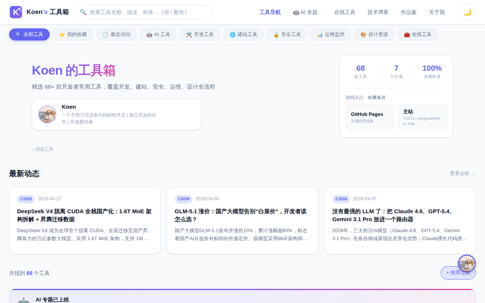

# Koen's 工具箱 · 开发者工具导航站

> 精选 **60+** 款开发 & 建站管理常用工具，纯静态实现，可直接部署到 **GitHub Pages**（默认）或 **1Panel**。分类与数量以页面实际展示为准。

## 预览



## 功能特性

- **分类筛选**：AI 工具 / 开发工具 / 建站工具 / 安全工具 / 运维监控 / 设计资源
- **实时搜索**：按名称、描述、标签即时过滤
- **暗色模式**：跟随系统偏好 + 手动切换，偏好持久化
- **工具详情页**：每个工具独立详情页，含同类推荐
- **响应式设计**：移动端、平板、桌面全适配
- **精选标记**：高频推荐工具标注精选徽章
- **🎮 彩蛋系统**：隐藏的"激活工具"分类，5 种趣味解锁方式！

## 工具分类

| 分类 | 数量 | 代表工具 |
|------|------|----------|
| 🤖 AI 工具 | 20 | DeepSeek、ChatGPT、Claude、Cursor、Midjourney |
| 🛠️ 开发工具 | 11 | VS Code、GitHub、Postman、CodeSandbox |
| 🌐 建站工具 | 8 | Vercel、Netlify、Cloudflare、Porkbun |
| 🔒 安全工具 | 6 | SSL Labs、VirusTotal、Bitwarden |
| 📊 运维监控 | 7 | UptimeRobot、Grafana、Sentry |
| 🎨 设计资源 | 7 | Figma、Iconify、Coolors、Google Fonts |
| 🔑 激活工具 | 2 | KMS 激活、JRebel 激活 |

> 上表为概览，条目数会随 `data/tools.js` 更新而变化。

## 文件结构

```
dev-tools-nav/
├── index.html              # 主页（导航 + 工具卡片列表）
├── favicon.ico / favicon.svg
├── css/style.css           # 全站样式（CSS 变量、暗色模式、响应式）
├── css/ai-topic.css        # AI 专题页样式
├── js/
│   ├── main.js             # 搜索过滤、分类、彩蛋、侧栏等
│   └── base.js             # 全站共用（如统计）
├── pages/
│   ├── template.html       # 工具详情页（?id=xxx）
│   ├── ai/                 # AI 专题：index、compare、workflow、prompts、beginner、glossary、safety、dev-api
│   ├── about.html 等       # 其他静态页
├── data/
│   ├── tools.js            # 工具数据 TOOLS_DATA
│   ├── ai-compare.js       # AI 专题数据（横评、工作流、Prompt、入门、价格、AI_TOOL_INFO）
│   ├── articles.js         # 首页「最新动态」文章区
│   └── servers.json        # JRebel 等（可由 Actions 同步更新）
├── assets/                 # 图片、Logo
├── docs/                   # 部署说明等（不随 Pages 发布，见 docs/README.md）
├── deploy.sh               # 同步到 1Panel 的本地脚本
└── .github/workflows/
    ├── deploy-pages.yml    # GitHub Pages 自动发布
    └── sync-jrebel.yml     # 定时同步 JRebel 配置
```

## AI 专题规划（`pages/ai` + `data/ai-compare.js`）

便于后续迭代：下列为**已实现**与**计划/未完成**内容，设计取向为静态精选手册（不追日更资讯、不做大而全百科）。

### 已完成

| 模块 | 说明 |
|------|------|
| **专题首页** `pages/ai/index.html` | Hero + 术语/安全链；**推荐学习路径** 5 步；**术语折叠预览**；**近期更新**（`AI_TOPIC_CHANGELOG`）；**场景速查内链**；探索专题卡（含 dev-api；工具名徽章 favicon）；价格 `id="pricing-ai"`；选型短文；**专题内导航条** |
| **开发者向** `pages/ai/dev-api.html` | 网页 vs API vs IDE 助手、何时用 API、链主站 `template.html` 与编程横评 |
| **术语与选型** `pages/ai/glossary.html` | 三条选型原则（`AI_SELECTION_PRINCIPLES`）+ 可展开术语表（`AI_GLOSSARY_DATA`） |
| **隐私与安全** `pages/ai/safety.html` | 清单式章节（`AI_SAFETY_DATA`） |
| **横评对比** `pages/ai/compare.html` | 6 组横评（对话 / 编程 / 绘图 / 搜索 / 视频 / 翻译），维度评分与结论 |
| **场景工作流** `pages/ai/workflow.html` | 多场景步骤 + 工具标签 + Prompt 片段 |
| **Prompt 模板库** `pages/ai/prompts.html` | 按分类筛选、复制模板；分类 section 设 `id="prompt-*"`，URL hash 可定位并自动筛分类 |
| **新手入门** `pages/ai/beginner.html` | 基础概念、上手步骤、误区、学习路径 |
| **数据与映射** `data/ai-compare.js` | 上列外加 `AI_TOPIC_CHANGELOG`、`AI_LEARN_PATH_STEPS`、`AI_GLOSSARY_DATA`、`AI_SELECTION_PRINCIPLES`、`AI_SAFETY_DATA`；以及 `AI_COMPARE_DATA`、`AI_WORKFLOW_DATA` 等 |
| **专题样式** `css/ai-topic.css` | 含 `ai-subnav`、changelog、场景速查内链、横评/工作流等各页布局；favicon 与徽章样式 |
| **全站入口** | `index.html` 导航「AI 专题」、AI 分类下横幅等（与 `js/main.js` 联动） |
| **SEO** | `scripts/generate-sitemap.mjs` 生成 `sitemap.xml` 时扫描 `pages/ai/*.html` 并写入 URL（CI 部署前执行） |

### 未完成 / 待办（按优先级）

**P0 — 已完成（2026）**

- [x] **术语与选型**：独立页 `glossary.html` + 首页 `<details>` 折叠预览 + Hero 快捷链
- [x] **隐私与安全清单**：独立页 `safety.html` + 首页与选型文末互链
- [x] **学习路径时间线**：专题首页 Hero 下，`AI_LEARN_PATH_STEPS`（入门 → 工作流 → Prompt → 横评 → 本页价格锚点）

**P1 — 已完成（2026-04）**

- [x] **开发者向**：`pages/ai/dev-api.html` + 专题入口卡片 + glossary 延伸阅读链
- [x] **更新说明**：首页 `AI_TOPIC_CHANGELOG`（人工维护最近条目，不承诺日更）
- [x] **场景速查 → 内链**：每张卡链到对应 `workflow#…`、`prompts#prompt-*`、`compare#compare-*`（「做视频」无单独工作流则仅链横评 + Prompt）
- [x] **学习路径微调**：拆为 5 步（入门 → 工作流 → **Prompt** → 横评 → 价格）
- [x] **专题内导航条**：各 AI 子页 header 下 `ai-subnav`（与 README 原「顶栏二级」等价落地为专题内条）

**P2（可选）**

- [ ] **按角色推荐组合**：产品 / 设计 / 研发等工具组合 + 链到 workflow（与 beginner 路径卡部分重叠，可做精简版首页条）
- [ ] **专题内推荐阅读**：统一底部组件（链博客、主站 AI 分类）；compare/workflow 页补充「延伸阅读」块
- [ ] **轻量交互**：纯前端按场景筛选高亮工具（数据来自 `AI_TOOL_INFO`）
- [ ] **术语增强**：中英对照、外链权威定义；glossary 页内 TOC 目录
- [ ] **更新说明自动化**：CI 或脚本从 git log /  front matter 生成 CHANGELOG（当前为手写数组）

**信息架构（可选）**

- [ ] 全站顶栏（`index.html` 根导航）下拉展示 AI 子页（当前为专题内 `ai-subnav` 已覆盖子页跳转）

**刻意不做（备忘）**

- 每日 AI 资讯流、维基级模型百科、账号体系与后端 — 与静态站定位与维护成本不匹配。

---

## 本地运行

直接用浏览器打开 `index.html`，或使用任意静态服务器：

```bash
# 使用 Python
python3 -m http.server 8080

# 使用 Node.js (npx)
npx serve .

# 使用 VS Code Live Server 插件
# 右键 index.html → Open with Live Server
```

## 部署到 GitHub Pages

仓库已配置 [`.github/workflows/deploy-pages.yml`](.github/workflows/deploy-pages.yml)：推送 `main` 后自动打包静态资源并发布（与 `deploy.sh` 排除规则一致，不包含 `docs/`、`.github` 等）。

| 步骤 | 说明 |
|------|------|
| 日常发布 | `git push origin main` → 打开 **Actions** → **Deploy GitHub Pages** 成功即可 |
| 首次 Fork / 新仓库 | 在 **Settings → Pages → Source** 选择 **GitHub Actions**；工作流里已设 `enablement: true`，多数情况下会自动启用 Pages |
| 线上地址 | **<https://songyuankun.github.io/dev-tools-nav/>** |

**费用**：本仓库为 **Public** 时，标准 GitHub Actions 用量对公开仓库通常 **不单独计费**；私有仓库有每月分钟数额度，详见 [GitHub Actions 计费](https://docs.github.com/zh/billing/concepts/product-billing/github-actions)。

> 可选：若不用 Actions，可在 Pages 中选 **Deploy from a branch** → `main` → `/ (root)`，与本工作流二选一即可。

## 部署到 1Panel

自建服务器可使用 1Panel 托管，与 GitHub Pages 无冲突。详细目录、`rsync` 与 `./deploy.sh` 说明见 **[docs/deploy-1panel.md](docs/deploy-1panel.md)**。

简要步骤：在 1Panel 创建静态网站 → 配置 Git 或手动同步仓库根目录下的 `index.html`、`css/`、`js/`、`data/`、`pages/`、`assets/` 等 → 绑定域名与 SSL。

## 添加新工具

编辑 `data/tools.js`，在 `TOOLS_DATA` 数组中添加新对象：

```js
{
  id: "unique-id",           // 唯一标识符（英文、数字、连字符）
  name: "工具名称",
  description: "工具描述，建议 50-100 字。",
  category: "dev",           // dev | hosting | security | ops | design
  tags: ["标签1", "标签2"],
  url: "https://example.com/",
  icon: "https://example.com/favicon.ico",  // 可选，加载失败会显示分类 emoji
  featured: false,           // true 表示精选，优先展示
}
```

## 添加新分类

编辑 `data/tools.js` 中的 `CATEGORIES` 数组：

```js
{ id: "new-category", label: "新分类名称", icon: "🆕" }
```

## 技术栈

- **纯静态**：HTML5 + CSS3 + Vanilla JS，零依赖，零构建
- **CSS 变量**：完整的设计 Token 系统，主题切换流畅
- **无障碍**：语义化 HTML，ARIA 标签，键盘可访问
- **性能**：图标懒加载，防抖搜索，CSS 动画硬件加速

## 🎮 彩蛋系统

"激活工具"分类被隐藏，需要通过有趣的解锁方式才能发现！

### 解锁方式

1. **URL 参数** ⭐ - 最简单
   ```
   http://your-site.com/?devtools2024=unlock
   ```

2. **Logo 连击** ⭐⭐ - 点击页面 Logo 7 次（3 秒内）

3. **Konami 代码** ⭐⭐⭐⭐ - 输入 ↑↑↓↓←→←→BA

4. **快捷键** ⭐⭐⭐ - 搜索框中按 Cmd/Ctrl+Shift+A

5. **页脚问号** ⭐ - 连续点击页脚的 "?" 7 次

### 更多信息

解锁逻辑与持久化见源码 **`js/main.js`**（搜索「彩蛋」相关注释）。

解锁后会显示：
- 🎊 撒花动画
- 💬 提示消息
- 🌀 分类按钮动画
- 持久化存储（一次解锁，永久享受）

## License

MIT

---

## 📁 相关文档

- **[docs/README.md](docs/README.md)** — 文档索引  
- **[docs/deploy-1panel.md](docs/deploy-1panel.md)** — 1Panel / 本机 `rsync` 部署  
- **[.github/workflows/deploy-pages.yml](.github/workflows/deploy-pages.yml)** — GitHub Pages CI  
- **[.github/workflows/sync-jrebel.yml](.github/workflows/sync-jrebel.yml)** — JRebel 地址定时同步
