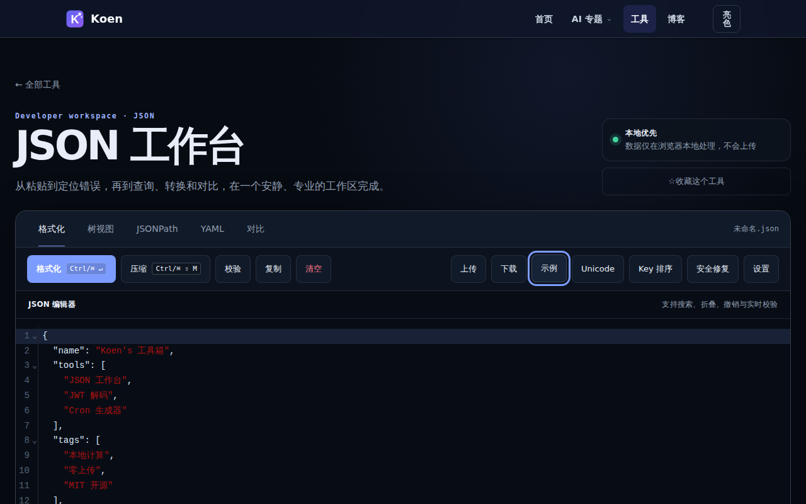

# Koen's 工具箱 · 开发者工具导航站

[](LICENSE)
[](https://github.com/SongYuanKun/dev-tools-nav/actions/workflows/test.yml)
[](CONTRIBUTING.md)

> 目录收录 71 条开发与建站资源，其中 10 款为浏览器内自研工具；`online-tools` 数据分类包含 11 条记录。纯静态实现，可直接部署到 **GitHub Pages**（默认）或 **1Panel**。分类与数量以 `data/tools.js` 为准。本项目以 MIT 协议开源，仅用于非商业开源用途的开发与贡献。

<!-- catalog-total: 71 -->
<!-- catalog-self-built: 10 -->
<!-- catalog-online-tools: 11 -->

## 关于本项目

**Koen's 工具箱是一个非商业的开源项目**：全部源码与站内原创内容都在 [MIT 协议](LICENSE)下公开，任何人都可以自由使用、修改并自行部署。

- **完全开源** — 代码、数据、文档和自动化脚本都在本仓库；`main` 分支即线上版本，构建、测试与发布由仓库内的 [测试工作流](.github/workflows/test.yml)和 [Pages 工作流](.github/workflows/deploy-pages.yml)完成。
- **非商业** — 不展示广告，不接入联盟推广、付费排名或赞助位，也不提供付费功能与商业授权；访问统计只用于判断维护投入方向。
- **内容边界** — 目录只收录正规工具与服务，不收录商业软件的破解、序列号或许可绕过类资源。
- **数据不出站** — 10 款自研在线工具全部在浏览器内计算，不向服务端上传用户输入。
- **欢迎贡献** — 提 Issue 或 Pull Request 前请先读 [贡献指南](CONTRIBUTING.md)，其中写明贡献范围、本地运行、自查命令与提交要求。

## 产品路线

本项目唯一活跃的路线来源是 [产品路线图](docs/roadmap.md)。当前技术栈继续使用 Vanilla HTML、CSS 和 JavaScript；阶段状态、准入条件、验收证据与非商业约束均在该路线图维护。

## 预览

| 首页导航 | JSON 工作台（树视图 / JSONPath / YAML / Diff） | 技术博客 |
|----------|------------------------------|----------|
|  |  |  |

> 截图由 `npm run capture-screenshots` 生成，见 [更新截图](#更新预览截图)。

## 功能特性

- **分类筛选**：AI 工具 / 开发工具 / 建站工具 / 安全工具 / 运维监控 / 设计资源 / 在线工具
- **实时搜索**：按名称、描述、标签即时过滤
- **暗色模式**：跟随系统偏好 + 手动切换，偏好持久化
- **工具详情页**：每个工具独立详情页，含同类推荐
- **在线工具集**：10 款浏览器内工具（JSON / 时间戳 / Cron / Base64 / JWT / SQL / 正则 / UUID / Diff / 颜色），纯前端、数据不出站
- **Markdown 博客流水线**：原创正文单一来源，自动生成文章、索引、Atom Feed、结构化数据与 sitemap 日期
- **响应式设计**：移动端、平板、桌面全适配
- **精选标记**：高频推荐工具标注精选徽章

## 在线工具（`/tools/`）

| 工具 | 路径 | 亮点 |
|------|------|------|
| **JSON 工作台** | `/tools/json/` | CodeMirror 实时诊断、树视图、JSONPath、YAML 双向转换、结构 Diff、宽松解析与安全修复 |
| 时间戳转换 | `/tools/timestamp/` | 秒/毫秒、多时区 |
| Cron 生成器 | `/tools/cron/` | 表达式解析与下次执行时间 |
| Base64 | `/tools/base64/` | 编解码 + SHA 摘要 |
| JWT 解码 | `/tools/jwt/` | Header/Payload 解析 + HMAC 验签 |
| SQL 格式化 | `/tools/sql-formatter/` | 关键字大写、缩进、压缩 |
| 正则测试 | `/tools/regex/` | 匹配高亮 + JS/Java 代码生成 |
| UUID 生成器 | `/tools/uuid/` | 批量生成 UUID |
| 文本 Diff | `/tools/diff/` | 文本差异对比 |
| 颜色工具 | `/tools/color/` | 颜色格式转换与预览 |

公开规范 URL 统一使用 `/tools/<slug>/`。`pages/tools/*.html` 是实现、嵌入或兼容页面，不是公开规范 URL。各工具页由 `js/tool-chrome.js` 统一导航与复制反馈；能力分布在各 `js/*-tool.js` 中（Path 查询、验签、SQL 分析、Diff 等）。

## 工具分类

与 `data/tools.js` 中 `CATEGORIES` 一致（不含「全部」）：

| 分类 | 数量 | 代表工具 |
|------|------|----------|
| 🤖 AI 工具 | 21 | Dify、Codeium 等（外链索引；选型见 [AI 专题](pages/ai/index.html)） |
| 🛠️ 开发工具 | 11 | VS Code、GitHub、Postman、CodeSandbox |
| 🌐 建站工具 | 8 | Vercel、Netlify、Cloudflare、Porkbun |
| 🔒 安全工具 | 6 | SSL Labs、VirusTotal、Bitwarden |
| 📊 运维监控 | 7 | UptimeRobot、Grafana、Sentry |
| 🎨 设计资源 | 7 | Figma、Iconify、Coolors、Google Fonts |
| 🧰 在线工具 | 11 | **JSON 格式化**、JWT 解码、时间戳、Cron、SQL、正则（含 10 款自研工具） |

> 目录合计 **71** 条，全部公开可见，没有隐藏分类。目录不收录商业软件激活、破解或许可绕过类内容。

## 文件结构

```
dev-tools-nav/
├── index.html              # 主页（导航 + 工具卡片列表）
├── favicon.ico / favicon.svg
├── css/
│   ├── style.css           # 全站样式（CSS 变量、暗色模式、响应式）
│   ├── tools.css           # 在线工具页共享样式
│   └── ai-topic.css        # AI 专题页样式
├── js/
│   ├── main.js             # 搜索过滤、分类、侧栏等
│   ├── base.js             # 全站导航注入、主题、Umami 统计
│   ├── json-core.mjs       # JSON 解析、转换、查询与 Diff 纯逻辑
│   ├── json-workbench.mjs  # JSON 工作台交互与 CodeMirror 状态
│   ├── tool-chrome.js      # 在线工具共享壳层（导航、Toast、本地处理提示）
│   ├── *-tool.js           # 其他工具独立逻辑（timestamp、cron 等）
│   ├── tools-hub.js        # 工具汇总页交互
│   └── ai-related-reads.js # AI 子页底部「延伸阅读」注入
├── pages/
│   ├── template.html       # 工具详情页（?id=xxx）
│   ├── ai/                 # AI 专题子页
│   ├── blog/               # 技术博客
│   └── tools/              # 在线工具（json、timestamp、cron 等）
├── content/blog/           # 站内原创博客 Markdown 唯一人工维护源
├── data/
│   ├── tools.js            # 工具数据 TOOLS_DATA
│   ├── ai-compare.js       # AI 专题数据（横评、工作流、Prompt、入门、价格、AI_TOOL_INFO）
│   ├── blog-manifest.json  # 构建生成的站内文章清单
│   ├── blog-posts.js       # 构建生成的博客列表数据
│   └── articles.js         # 首页「最新动态」文章区
├── assets/                 # Logo、预览截图（screenshot*.png）
├── scripts/
│   ├── build-blog.mjs           # 生成文章、索引、清单与 Atom Feed
│   ├── capture-screenshots.mjs  # Playwright 截取 README 用预览图
│   ├── sync-csdn-rss.py         # 同步 CSDN RSS
│   └── sync-open-source-radar.py # 同步 AI 开源项目雷达
├── docs/                   # 部署说明等（不随 Pages 发布，见 docs/README.md）
├── deploy.sh               # 本地手动发布兼容入口（委托原子部署脚本）
├── package.json            # npm test、capture-screenshots（Playwright）
├── feed.xml                # 构建生成的 Atom Feed
└── .github/workflows/
    ├── deploy-pages.yml    # GitHub Pages 自动发布
    ├── update-screenshots.yml # 每周计划运行；成功状态以 GitHub Actions 为准
    ├── sync-csdn-rss.yml      # 定时同步 CSDN RSS
    └── sync-open-source-radar.yml # 每周同步 AI 开源项目雷达
```

## AI 专题（当前能力）

AI 专题当前是静态精选手册，已上线能力如下。后续优先级与状态只在 [产品路线图](docs/roadmap.md) 维护，本节不保存第二份路线或待办。

| 模块 | 说明 |
|------|------|
| **专题首页** `pages/ai/index.html` | Hero + 术语/安全链；**推荐学习路径** 5 步；**术语折叠预览**；**近期更新**（`AI_TOPIC_CHANGELOG`）；**按角色快选**（`AI_ROLE_QUICK_PICK`）；**场景速查内链**；探索专题卡（含 dev-api；工具名徽章 favicon）；价格 `id="pricing-ai"` + **快照日期**（`AI_PRICING_SNAPSHOT_DATE`）；选型短文；**专题内导航条**；底部 **延伸阅读**（`js/ai-related-reads.js`） |
| **开发者向** `pages/ai/dev-api.html` | 网页 vs API vs IDE 助手、何时用 API、链主站 `template.html` 与编程横评 |
| **AI 开源项目雷达** `pages/ai/open-source-radar.html` | 每周筛选 GitHub Trending 中 AI/ML/Agent 热门项目，按本周新增 Star 排序，提供中文概述、核心功能和适用场景标签；数据由 `scripts/sync-open-source-radar.py` + [`.github/workflows/sync-open-source-radar.yml`](.github/workflows/sync-open-source-radar.yml) 每周一自动同步，中文解读可人工润色 |
| **术语与选型** `pages/ai/glossary.html` | 三条选型原则（`AI_SELECTION_PRINCIPLES`）+ 可展开术语表（`AI_GLOSSARY_DATA`）+ **页内术语目录（TOC）** |
| **隐私与安全** `pages/ai/safety.html` | 清单式章节（`AI_SAFETY_DATA`） |
| **横评对比** `pages/ai/compare.html` | 6 组横评（对话 / 编程 / 绘图 / 搜索 / 视频 / 翻译），维度评分与结论；**页顶声明**（`AI_COMPARE_PAGE_DISCLAIMER`）；每组 **方法/局限**（`AI_COMPARE_META`） |
| **场景工作流** `pages/ai/workflow.html` | 多场景步骤 + 工具标签 + Prompt 片段 |
| **Prompt 模板库** `pages/ai/prompts.html` | 按分类筛选、复制模板；分类 section 设 `id="prompt-*"`，URL hash 可定位并自动筛分类 |
| **新手入门** `pages/ai/beginner.html` | 基础概念、上手步骤、误区、学习路径 |
| **数据与映射** `data/ai-compare.js` | 上列外加 `AI_TOPIC_CHANGELOG`、`AI_LEARN_PATH_STEPS`、`AI_GLOSSARY_DATA`、`AI_SELECTION_PRINCIPLES`、`AI_SAFETY_DATA`；以及 `AI_COMPARE_DATA`、`AI_COMPARE_META`、`AI_COMPARE_PAGE_DISCLAIMER`、`AI_WORKFLOW_DATA`、`AI_LOOKUP_SCENES`（场景速查 + `toolIds`）、`AI_RELATED_READS_LINKS`、`AI_TRUST_STATEMENT`、`AI_PRICING_SNAPSHOT_DATE`、`AI_ROLE_QUICK_PICK` 等；术语条目支持可选 `termEn` / `seeAlso` |
| **Changelog 自动化** `scripts/generate-ai-changelog.mjs` | CI 部署前从 git log 提取 AI 专题 commit，按日期分组，智能生成 title/detail，自动写入 `data/ai-compare.js` |
| **专题样式** `css/ai-topic.css` | 含 `ai-subnav`、changelog、场景速查内链、横评/工作流等各页布局；favicon 与徽章样式 |
| **全站入口** | `index.html` 导航「AI 专题」、AI 分类下横幅等（与 `js/main.js` 联动） |
| **SEO** | `scripts/generate-sitemap.mjs` 生成 `sitemap.xml` 时扫描 `pages/ai/*.html` 并写入 URL（CI 部署前执行） |

---

## 本地运行

直接用浏览器打开 `index.html`，或使用任意静态服务器：

```bash
# 使用 Python
python3 -m http.server 8080

# 使用 Node.js (npx)
npx serve .

# 使用 VS Code Live Server 插件
# 右键 index.html → Open with Live Server
```

### 更新预览截图

修改首页或在线工具 UI 后，在仓库根目录执行：

```bash
# 终端 1：起静态服务（端口勿与占用冲突）
python3 -m http.server 9876

# 终端 2：截取 assets/screenshot*.png
BASE_URL=http://127.0.0.1:9876 npm run capture-screenshots
```

输出文件：

| 文件 | 页面 |
|------|------|
| `assets/screenshot.png` | 首页 |
| `assets/screenshot-json-tool.png` | JSON 工具（自动点「示例」） |
| `assets/screenshot-blog.png` | 博客列表 |

CI 工作流 [`.github/workflows/update-screenshots.yml`](.github/workflows/update-screenshots.yml) 每周计划运行；成功状态以 GitHub Actions 为准。

## 部署到 GitHub Pages

仓库已配置 [`.github/workflows/deploy-pages.yml`](.github/workflows/deploy-pages.yml)：推送 `main` 后，Test 检查提交，Pages workflow 构建并发布静态资源。GTR 主机通过出站轮询部署同一提交；完整运维流程见 [1Panel 部署说明](docs/deploy-1panel.md)。

| 步骤 | 说明 |
|------|------|
| 日常发布 | `git push origin main` → 打开 **Actions** → **Deploy GitHub Pages** 成功即可 |
| 首次 Fork / 新仓库 | 在 **Settings → Pages → Source** 选择 **GitHub Actions**；工作流里已设 `enablement: true`，多数情况下会自动启用 Pages |
| 线上地址 | **<https://songyuankun.github.io/dev-tools-nav/>** |

**费用**：本仓库为 **Public** 时，标准 GitHub Actions 用量对公开仓库通常 **不单独计费**；私有仓库有每月分钟数额度，详见 [GitHub Actions 计费](https://docs.github.com/zh/billing/concepts/product-billing/github-actions)。

> 可选：若不用 Actions，可在 Pages 中选 **Deploy from a branch** → `main` → `/ (root)`，与本工作流二选一即可。

## 部署到 1Panel

GTR 主机每十分钟出站检查 `main`，仅部署已通过精确 SHA Test 门禁的提交。安装、首次启用、诊断、回滚和验收统一见 **[docs/deploy-1panel.md](docs/deploy-1panel.md)**。

## 添加新工具

编辑 `data/tools.js`，在 `TOOLS_DATA` 数组中添加新对象：

```js
{
  id: "unique-id",           // 唯一标识符（英文、数字、连字符）
  name: "工具名称",
  description: "工具描述，建议 50-100 字。",
  category: "dev",           // dev | hosting | security | ops | design | online-tools | ai
  tags: ["标签1", "标签2"],
  url: "https://example.com/",
  icon: "https://example.com/favicon.ico",  // 可选，加载失败会显示分类 emoji
  featured: false,           // true 表示精选，优先展示
}
```

## 添加新分类

编辑 `data/tools.js` 中的 `CATEGORIES` 数组：

```js
{ id: "new-category", label: "新分类名称", icon: "🆕" }
```

## 技术栈

- **纯静态**：HTML5 + CSS3 + Vanilla JS，零依赖，零构建
- **CSS 变量**：完整的设计 Token 系统，主题切换流畅
- **无障碍**：语义化 HTML，ARIA 标签，键盘可访问
- **性能**：图标懒加载，防抖搜索，CSS 动画硬件加速

## License

本项目采用 [MIT 协议](LICENSE)，是非商业开源项目；二次分发与自建部署请保留版权与许可声明。

---

## 📁 相关文档

- **[CONTRIBUTING.md](CONTRIBUTING.md)** — 贡献指南：贡献范围、本地运行、自查命令与提交要求
- **[LICENSE](LICENSE)** — MIT 许可证全文
- **[manual.md](manual.md)** — 简明使用说明（含在线工具与截图）  
- **[docs/roadmap.md](docs/roadmap.md)** — 唯一活跃产品路线图
- **[docs/README.md](docs/README.md)** — 文档索引  
- **[docs/deploy-1panel.md](docs/deploy-1panel.md)** — GTR 出站轮询部署、回滚与运维
- **[.github/workflows/deploy-pages.yml](.github/workflows/deploy-pages.yml)** — GitHub Pages CI  
- **[.github/workflows/update-screenshots.yml](.github/workflows/update-screenshots.yml)** — 预览截图自动刷新  
- **[.github/workflows/sync-csdn-rss.yml](.github/workflows/sync-csdn-rss.yml)** — CSDN 文章列表定时同步
