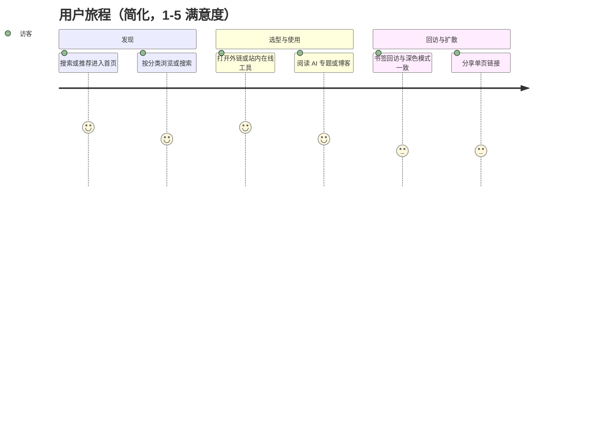
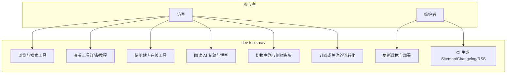
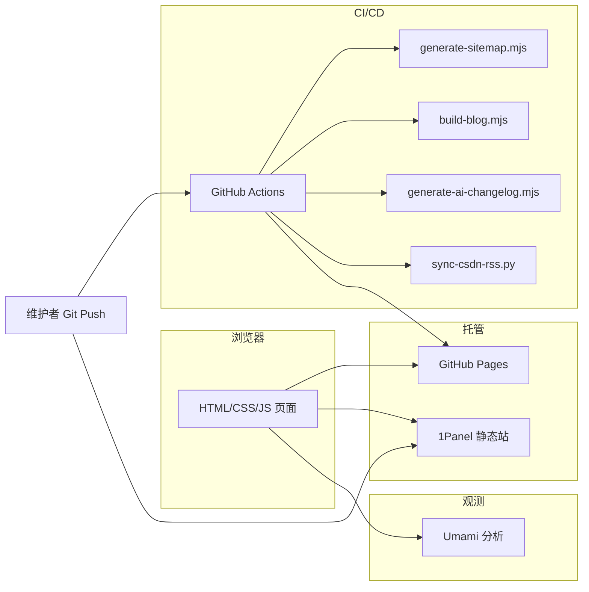

# dev-tools-nav 全流程交付套件

> **适用范围**：本项目为个人维护的静态开发者工具导航站（HTML/CSS/香草 JS + GitHub Actions + 可选自建 1Panel）。  
> 本文档将标准软件交付流程 **裁剪并对齐** 到静态站形态；凡与「中大型前后端分离系统」默认值不一致之处，均以 **本节说明 + 等价指标** 替代，避免纸面造假。

---

## 第一部分 《需求调研报告》（需求发现）

### 1.1 项目背景与目标

| 维度 | 说明 |
|------|------|
| 产品形态 | 纯静态站点：工具导航首页、外链详情模板、自建在线小工具、AI 专题子站、博客列表与文章、关于与产品页 |
| 目标用户 | 个人开发者、后端/全栈、希望快速发现工具与 AI 选型参考的读者 |
| 商业目标 | 个人品牌触达、搜索自然流量、低维护成本下的长期可运营（非实时服务、无 SLA 合同义务） |
| 约束 | 避免重框架与重后端；内容以「精选 + 自研工具 + 专题手册」为主 |

### 1.2 用户访谈 / 反馈渠道（可执行模板）

静态站无账号体系，建议用 **轻量渠道** 替代正式访谈：

- **访谈对象**：3～5 名同行（同事/社区），每人 20 分钟。
- **核心问题清单**  
  1. 你最近一次用导航站是为了解决什么任务？  
  2. 首页分类与搜索是否能在 10 秒内找到目标？  
  3. AI 专题里你最常打开哪一页？缺什么？  
  4. 是否愿意把本站设为浏览器起始页或书签？阻碍是什么？  
  5. 对「在线工具全部纯前端、数据不出站」是否在意？

输出物：每次访谈记 1 页纪要（痛点原话 + 优先级标签）。

### 1.3 竞品分析（摘要）

| 竞品类型 | 代表 | 可借鉴 | 差异化 |
|----------|------|--------|--------|
| 大型导航 | Awesome 系列、各类 DevTools 聚合 | 分类清晰、GitHub 引流 | 个人 IP + 中文场景 + 自研工具 + AI 专题深度 |
| 在线工具站 | json.cn、各类 formatter | 长尾 SEO、单页工具 | 与导航统一品牌、无广告干扰体验 |
| 知识型 | 文档站/VitePress 博客 | 系列文章、内链体系 | 控制范围：静态手工/半自动，避免维基级维护 |

**结论**：本产品定位是「**小而精的工具箱 + 可信赖的选型短文**」，不是最全索引。

### 1.4 业务痛点归纳

| ID | 痛点 | 证据来源 |
|----|------|----------|
| P1 | 仅外链聚合时用户停留时间短、回流弱 | 行为数据（Umami）、跳出率 |
| P2 | 原创内容在第三方平台，主站SEO资产弱 | 历史内容策略 |
| P3 | 缺乏可差异化的「必须用你站」的自研工具 | 与竞品对比 |
| P4 | 信任与免责：横评、价格、外链需可追溯 | 合规与回访反馈 |

### 1.5 用户故事地图（核心旅程）

横向：「发现 → 选型/使用 → 收藏回访 → 分享」；纵向拆解活动与故事。



### 1.6 核心用例（UML 用例图）



### 1.7 功能清单（与 MoSCoW）

| Must-have | Should-have | Could-have | Won't-have |
|-----------|-------------|------------|------------|
| 首页分类与实时搜索可用 | AI 专题子站完整内链 | 首页顶栏 AI 下拉导航 | 直播/社群实时运营 |
| 工具数据可维护 (`data/tools.js`) | 更多自研在线工具（SQL/正则等） | 纯前端场景高亮工具的扩展 | 用户账号体系与评论后端 |
| 在线工具隐私边界清晰（纯前端） | 术语表持续补 `seeAlso` | 邮件订阅表单（第三方 embed） | 同时维护多套大型文档生成器 |
| SEO：sitemap、meta、canonical 关键页 | Lighthouse/可访问性基线 CI | Affiliate 可追溯标注 | 「日更 AI 资讯流」 |
| 双托管：Pages + 1Panel 备份部署 | Umami 自托管统计 | Playwright 关键路径冒烟 | 承诺合同级 SLA 与销售型 UAT |

### 1.8 需求优先级矩阵说明（MoSCoW）

- **Must**：影响「能否被找到、能否安全使用、能否持续部署」；
- **Should**：明显提升留存与个人品牌；
- **Could**：锦上添花、排期松散；
- **Won't**：与静态站与个人时间预算冲突的能力，明确不写进路线图以免范围蔓延。

---

## 第二部分 《系统架构设计说明书》（技术方案）

### 2.1 总体架构



**说明**：无应用服务器运行时；服务端职责由 **CDN/静态宿主 + Actions 离线构建** 承担。

### 2.2 技术栈选型

| 层级 | 选型 | 理由 |
|------|------|------|
| 表现层 | HTML5、CSS 变量主题、香草 JS | 低依赖、长寿命、易托管 |
| 数据层 | `data/*.js` 静态注入、JSON 辅助 | 无 DB，通过 PR/脚本更新 |
| 构建 | Node 脚本（sitemap、blog、changelog） | 轻量、与 Actions 一致 |
| 部署 | GitHub Pages + rsync 至 1Panel | 双源可用、个人站常见 |
| 分析 | Umami（自托管） | 隐私友好、无第三方广告追踪 |

### 2.3 接口契约（静态站等价物）

本项目无 REST API，契约定义为 **「页面 URL 契约」** 与 **「数据文件形状」**。

**页面 URL（示例）**

- `index.html`：首页；查询参数与 hash 若使用须文档化（如 `template.html?id=`）。
- `pages/tools/*.html`：各在线工具；可选 `?q=` 等由页面脚本约定。
- `pages/ai/*.html`：AI 专题；锚点 `id` 与 `data/ai-compare.js` 中链接一致。
- `pages/blog/*.html`：博客；列表由 `data/blog-posts.js` 驱动。

**脚本契约（摘录）**

| 脚本 | 输入 | 输出 |
|------|------|------|
| `generate-sitemap.mjs` | 仓库内 HTML 路径、`BASE_URL` | `sitemap.xml` |
| `build-blog.mjs` | `content/` 下 Markdown（若启用） | `pages/blog/*.html` |
| `generate-ai-changelog.mjs` | `git log` 限定路径 | 覆写 `data/ai-compare.js` 中 `AI_TOPIC_CHANGELOG` |

### 2.4 逻辑数据模型（概念层）

```
TOOLS_DATA[]
  id, name, category, tags, url, icon, featured, content?

CATEGORIES[]
  id, label, icon, hidden?

AI_COMPARE_DATA[], AI_WORKFLOW_DATA[], AI_GLOSSARY_DATA[]
  （专题域模型，详见 data/ai-compare.js）

BLOG_POSTS[]
  id, title, date, url | externalUrl, category, ...

ARTICLES / CSDN 同步 JSON
  （首页动态区数据源）
```

### 2.5 非功能性需求（NFR）

| 类别 | 指标 | 当前落地 | 备注 |
|------|------|----------|------|
| 性能 | LCP/FCP 基线 | 建议 CI 引入 Lighthouse budgets | TPS **不适用**（无服务端接口） |
| 安全 | XSS、三方脚本最小化 | 减少内联三方；外链 `rel="noopener"` | JWT/编解码工具强调本地处理 |
| 可用性 | 静态托管可用性依赖 GitHub/自有服务器 | 双部署降低单点 | **99.9% SLA** 需合同与监控系统支撑，本站为 **目标志向** |
| 可维护性 | 单仓库、脚本可复现构建 | Actions 清单即文档 | |
| SEO | sitemap、结构化数据关键页覆盖 | 已部分实施 | canonical 查漏补缺 |

---

## 第三部分 《迭代开发计划》（两周 Sprint）

以下为 **可直接抄到看板** 的示例排期（负责人填真实姓名）。“估时”为 **人天** 量级，适用于业余维护节奏。

### Sprint 1（工具与导航）

| Story | Task | 估时 | DoD |
|-------|------|------|-----|
| 在线工具-SQL 格式化 | 页面 + `TOOLS_DATA` + sitemap | 1.5 | 三款浏览器手测通过；错误提示可读 |
| 搜索体验 | main.js 防抖/无障碍标签复查 | 0.5 | 键盘可操作；无明暗对比失败 |
| 文档 | README 与新工具占位说明 | 0.25 | MR 评审通过 |

### Sprint 2（内容与信任）

| Story | Task | 估时 | DoD |
|-------|------|------|-----|
| 博客 canonical | 抽查所有 `pages/blog/*.html` | 0.5 | Search Console 无重复抓取告警（观察期） |
| Affiliate 标注规范 | template 外链规则草拟 + README | 0.5 | 未来带参链接可追溯 |
| Playwright 冒烟 | 首页 + AI 首页 + 1 在线工具 | 1 | Actions 绿灯 |

### Sprint 3（质量与观测）

| Story | Task | 估时 | DoD |
|-------|------|------|-----|
| Lighthouse CI | budget 阈值文件 + workflow | 1 | PR 不达标可失败或可警告（团队先约定） |
| Umami 目标 | 关键转化事件（出站点击分类） | 0.5 | 面板可看图 |

### 代码规范（建议）

| 项 | 建议 |
|----|------|
| HTML | 语义标签、`lang="zh-CN"`、关键图标 `aria-label` |
| JS | `'use strict'`、避免全局污染、DOM 使用前判空 |
| CSS | 设计令牌复用 `--` 变量，与 `style.css` / `ai-topic.css` 一致 |
| Commit | Conventional Commits（与 `generate-ai-changelog` 解析一致） |

### 分支策略（Git）

采用 **精简 Git Flow**：`main` 可发布，`feature/*` 短分支开发，合并前 **至少自建 diff 审查**。若仅一人维护，可直接 `main` + 小而频的 commit，但必须保持 **Actions 可用**。

### CI/CD 流水线（现状对齐）

| 工作流 | 作用 |
|--------|------|
| `deploy-pages.yml` | Checkout 全历史 → blog → sitemap → AI changelog → RSS → `_site` 发布 Pages |
| 其他 | JRebel/CSDN/截图等定时或辅助 |

### 静态代码扫描阈值（对齐说明）

| 企业默认 | 本项目等价 |
|----------|------------|
| SonarQube Major+ 清零 | **未接入**。可选：SonarLint 本地、`eslint`/`htmlhint` 择一渐进接入 |
| 单测覆盖率 ≥80% | **当前无单元测试目录**。对等路径：抽出 `scripts/*.mjs` 纯函数后用 `node:test` / Vitest |

---

## 第四部分 实现与质量控制（可操作检查单）

### 4.1 测试策略（替换「接口自动化100% + TPS」）

| 类型 | 目标 | 实现手段 |
|------|------|----------|
| 单元测试 | 对 **构建脚本** 与可选 **纯函数** 逐步达到 ≥80% | 新建 `tests/`、`npm test` |
| 核心路径 **100%** 覆盖 | Smoke：首页加载、搜索、打开一外链、一开站在线工具、一 AI 子页 | Playwright（仓库已有 playwright 依赖，可扩展 workflow） |
| 性能 **≥ 预期 ×1.2** | 用 **Lighthouse 性能分数 / LCP ms** 代 TPS | 本地或 CI budgets |
| 安全 **高危=0** | 依赖：`npm audit`；页面：外链与 `target=_blank`、博客用户生成内容风险控制 | 发布前自检表 |

### 4.2 Code Review

- **每日**：个人项目可降为 **每次推送前自检**（diff 自检清单）。  
- 检查项：安全敏感词、破坏性改 URL、无障碍回归、大图未压缩。

### 4.3 SonarQube Major+ 清零

- **现状**：流水线未挂载 Sonar。  
- **达标路径**：任一 Sprint 挂载 `SonarCloud`（公开仓库免费档）只做 **新代码门禁**，再逐步清零历史欠款。

---

## 第五部分 《验收测试报告》模板（验收与验证）

### 5.1 功能测试结果

| 用例编号 | 场景 | 期望 | 结果 | 备注 |
|----------|------|------|------|------|
| F-01 | 首页搜索过滤 | 输入关键字卡片实时过滤 | 待测 | |
| F-02 | 在线 JSON 工具 | 非法 JSON 报位置合理 | 待测 | |
| F-03 | AI 专题延伸阅读 | 链到博客与首页相对路径正确 | 待测 | |
| … | … | … | … | |

### 5.2 性能测试结果（Lighthouse 示例表头）

| 页面 | Performance | LCP(s) | CLS | 结论 |
|------|-------------|--------|-----|------|
| `/index.html` |  |  |  |  |
| `/pages/ai/index.html` |  |  |  |  |

### 5.3 安全与兼容性

| 项 | 方法 | 通过标准 |
|----|------|----------|
| 依赖漏洞 | `npm audit` | 无 high+ 或已全部评估接受 |
| 浏览器 | Chromium + Safari + 移动宽度 | 无布局崩溃 |
| 外链 | spot check | `noopener` + 跳转正确 |

### 5.4 可靠性 / 发布后

| 企业要求 | 个人站落地 |
|----------|------------|
| 7×24 监控告警 | GHA 失败邮件/通知；1Panel/UptimeRobot 可选探活 |
| SLA ≥99.9% | **无对外合同则不写 SLA 承诺**；可写「目标可用性观测方式」 |

### 5.5 用户 UAT 签字确认

| 版本 | UAT 执行人 | 日期 | 结论 | 签字 |
|------|------------|------|------|------|
| YYYY-MM |  |  | 通过/附带缺陷单 | ______ |

缺陷关闭率 100%、关键回归通过：**在Issue/表格中逐项勾选**。

### 5.6 上线后 30 天《项目总结与优化路线图》（提纲）

1. Umami：**UV/PV**、出站 Top10、专题漏斗。  
2. Search Console：**展示/点击**、查漏 URL。  
3.  backlog：MoSCoW 再校准一轮。  
4. 技术债：测试覆盖、Sonar、Lighthouse budgets。  

---

## 附录：与本仓库现状的对照诚实说明

| 要求原文 | 仓库现状 |
|----------|----------|
| 单元测试覆盖率 ≥80% | **未达到**；需新增测试 harness |
| Sonar Major+ 清零 | **未接入** |
| 接口自动化 + TPS | **不适用**；已文内替换 |
| UAT 书面签字 | 模板已给；按需执行 |

本文件是一份 **可复制到真实项目监管的骨架**；填入实测数据后即构成正式《需求调研》《架构设计》《验收报告》等系列交付物正文。
